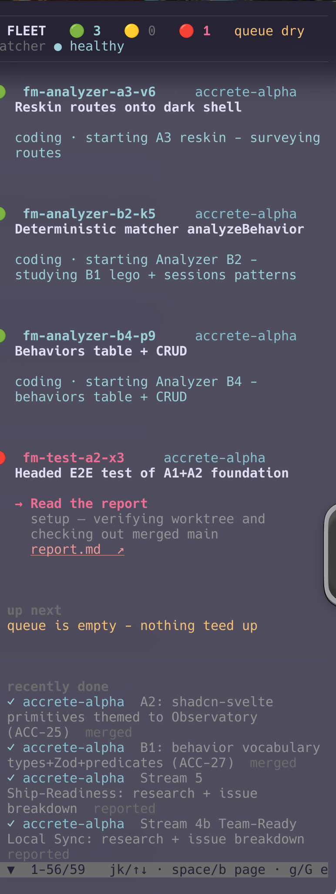

# fm-status - the firstmate fleet board

One calm, single-column view of every in-flight crew job, reconciled live from a firstmate home's on-disk state.
Run it in a spare pane and leave it open - each job is a card with a **3-color semaphore** that tells you, at a glance, whether anything needs you.

Single self-bootstrapping [`uv`](https://docs.astral.sh/uv/) script (Python + [Rich](https://github.com/Textualize/rich)) - no venv, deps resolve on first run.
It only *reads* firstmate state, so it is always safe against a live home.

## The semaphore

Color answers one question: **how much of your attention does this want?**

| | when | meaning | your move |
|---|---|---|---|
| 🟢 | `working` | **cranking** - actively working | nothing; it shows what it's doing (`coding` / `researching`) |
| 🟡 | stopped with no ask, or state unclear | **paused, nothing waiting on you** | watch - hopefully self-resolving |
| 🔴 | a real ask, or it broke | **needs you** - a ready PR, a decision, an approval, a held local test, a report to read, or a failure | act - shown with the link to get there |

Green is "leave it alone." Yellow is the quiet middle - it paused, keep half an eye on it, but nothing is waiting on you. Red is the only color that wants you, and a red card spells out the action *and* surfaces the PR / board / report link straight from firstmate's `state/.hb-surfaced-<id>` files.

The board sorts by that same question: **red at the top, yellow next, green last**, so your next action is always the first card. Within a color band, rows follow the tmux tab order and stay put.

The call comes from `fm-crew-state.sh` (the authority) plus what firstmate last surfaced: a crewmate's unverified "done" stays yellow; a ready PR, a held test, a report, or a CI-verified "done" turns red.

**Finished jobs are not a semaphore color.** They drop to a dim ✓ in the recently-done tail (and the roadmap). Green means *working*, never *done*.

## Run

Install once (see the [repo README](../README.md)), then run it from anywhere inside a firstmate home:

```sh
fm-status              # one-shot render (semaphore cards)
fm-status --watch      # live, scrollable board (reloads every 5s)
fm-status --watch 2    # reload every 2s
fm-status --roadmap    # per-project timeline (see below)
fm-status --roadmap accrete   # just projects matching "accrete"
fm-status --table      # dense one-row-per-job table instead of cards
fm-status --no-done    # hide the "recently done" tail
FM_HOME=/path fm-status   # point at a firstmate home from anywhere
```

It finds the home like git finds a repo: `--home` wins, then `$FM_HOME`, then it walks up from your current directory. From a clone, `./fm-status` runs the script directly (requires [`uv`](https://docs.astral.sh/uv/)).

`--watch` runs in the alternate-screen buffer (like `top`/`htop`), so **resizing the terminal repaints cleanly** instead of garbling, and your original screen is restored on `q` / Ctrl-C.

### Scrolling

A busy fleet is taller than any pane, so the live board is a **scrollable viewport** - nothing is ever cropped out of reach:

| key | move |
|---|---|
| `j` / `k` or `↓` / `↑` | line |
| `space` / `b` (or `PgDn` / `PgUp`) | page |
| `g` / `G` | top / bottom |
| `q` | quit |

When the board overflows, the bottom row is a live position indicator - `▲▼ 1-56/59 …` - showing where you are and which way there's more. Scrolling responds instantly and **doesn't pause the live refresh**: the fleet keeps reconciling on the `--watch` interval while you read.



## The roadmap (`--roadmap`)

A per-project timeline built from `data/backlog.md`, which tags every item with its `(repo: …)` and files it under `## In flight` / `## Queued` / `## Done`:

- **✓ done** (dim) - the journey so far, oldest first
- **🟢 / 🟡 / 🔴 active** (bold) - in-flight jobs, with the live semaphore from `fm-crew-state`
- **☐ queued** (dim) - planned ahead, not started

So a project reads top-to-bottom as past → present → future, and the bold active rows are where the eye lands. `--roadmap <name>` filters to matching projects.

## What it reads

| Source | For |
|---|---|
| `state/*.meta` | the set of in-flight jobs + project/kind/mode/model/effort |
| `bin/fm-crew-state.sh <id>` | the **reconciled** current state (the authority - never a stale "done") |
| `tmux list-windows` | tab order, used to keep rows stable within each color band |
| `data/backlog.md` | each job's one-line purpose, the queue, and the recently-done tail |
| `data/projects.md` | project names |
| `state/.last-watcher-beat` | watcher health in the header |

## Up next (queue depth)

Below the in-flight cards, an **up next** section lists the `## Queued` items (`☐ title · project`) - visible even while jobs run, so you can see what's teed up. The header carries a queue-depth readout (`N queued`, or **`queue dry`** in amber when it's empty), so a drying pipeline is obvious at a glance.

## Design

**Calm captain's bridge.** The semaphore is the whole point: color maps to *your action*, and everything not carrying that meaning is dim or muted, so a healthy fleet looks quiet and a yellow/red card jumps. Degrades correctly - piped or under `NO_COLOR` it drops all color but keeps the emoji and the spelled-out action, so nothing is color-only.

## Files

- `fm_status.py` - the app (single file, uv inline deps).
- `fm-status` - thin launcher (`uv run` wrapper).
- `_demo.py` - dev harness: renders a synthetic all-three-colors fleet to `_shot.svg` for visual iteration. Not part of the tool.
